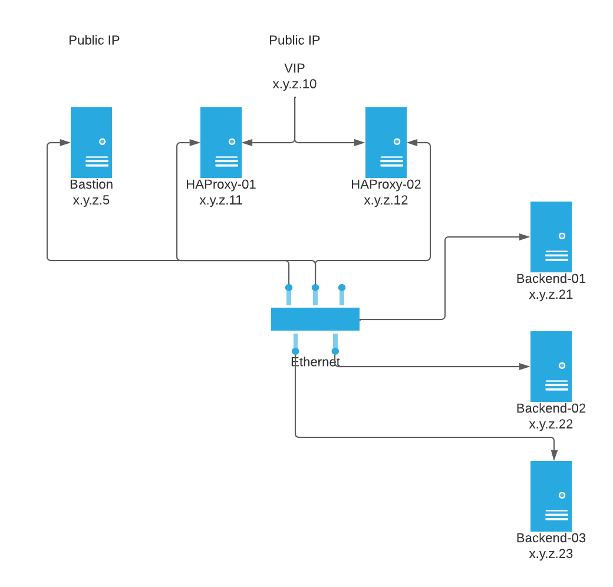

HEAT templates and ansible for creating a highly available HA proxy setup. The
ansible is not dependant on OpenStack so you don't have to use HEAT, but it's
what I have chosen for this demo. As long as you have servers that ansible can
connect to using ssh the playbook should still work.

The HowToTest.md document has more details on creating the environment and
testing that everything works.

Create the environment by running the HEAT templates
```bash
cd heat
openstack stack create -t ha-proxy-env.yaml ha2-proxy --wait -e env.yaml
```

If you need to re-create the stack:

```bash
openstack stack delete ha2-proxy --wait -v --yes
```

Create the ansible inventory by running the build_inventory.py script

```bash
openstack server list --format json --long | python build_inventory.py > ansible/inventory
```

Also update the group_vars file to reference the new bastion or ssh to internal
hosts will not work.

There is a some helper script that might be useful here, see 
build_group_vars.py.

Run the ansible playbook (will take a long time because of the dnf updates). 
Wait for ssh to be available on the VMs before running the playbook.

The playbook expects a number of variables to be passed as "extra variables".
This can be done either by passing each variable on the command line or using a
file containing the variables.

The variables are:

satellite_host: Hostname or IP address of a satellite host to register the VMs 
to.

disable_gpg: Disable gpg checks for dnf. Either true or false.

satellite_org: The organisation name to use when registering to satellite.

satellite_activation_key:  The activatiojn key\to use when registering to
satellite.

ha_backend_test_port: The port number for the second test app (the first app
assumes port 80, the second one is intended to test using a different port)

vrrp_password: The password for vrrp authentication by keepalived.

There's env.yaml.sample file in the ansible directory to use as a template.

```bash
cd ansible
ansible-playbook -i inventory playbook.yaml \
  -e "satellite_host=satellite.example.com" \
  -e 'satellite_org="Example Org"' \ 
  -v
```

or

```bash
ansible-playbook -i inventory playbook.yaml -v -e @env.yaml
```

## Network Diagram

